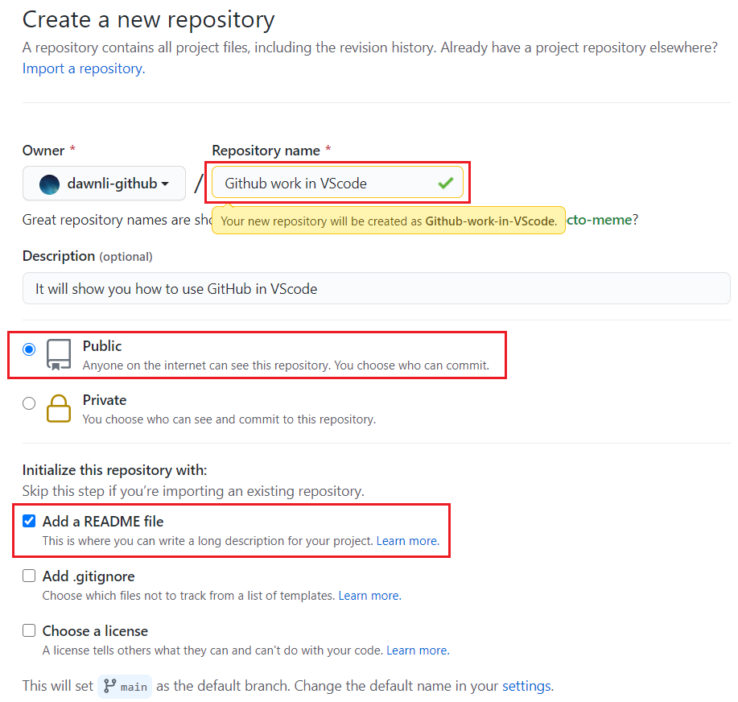

# Github-work-in-VScode

It will show you how to use GitHub in VScode. 

## 1. Setting config in VScode terminal

```shell
git config --global user.name "your github name" 
git config --global user.email "your github email"
```

## 2. Create a repository and init it



This operation is equivalent to typing in the VScode terminal:

```shell
git init
git add README
git commit -m 'First commit'
```

## 3. Clone(Pull) repository
### Clone

* Open VScode in your work folder and use its terminal

```shell
git clone  https://github.com/*****.git
cd "your repository"
```

(If you have initialized the repository at your work folder, then you do not have to do this step.)

### Pull


This operation is equivalent to typing in the VScode terminal:

```shell
git fetch --all
git reset --hard
git pull origin master
```

## 4. Push your change to Github

* When you finish your code edit or do some other changes have been made to the project, you can push your change to Github in this way. 


This operation is equivalent to typing in the VScode terminal:

```shell
git add .
git commit -m 'update some file'
git push origin master
```

(In VScode, when you add file to your repository and you don't need to use the "git add ." command.)

# Then you can during basic operate of Github in VScode. 
